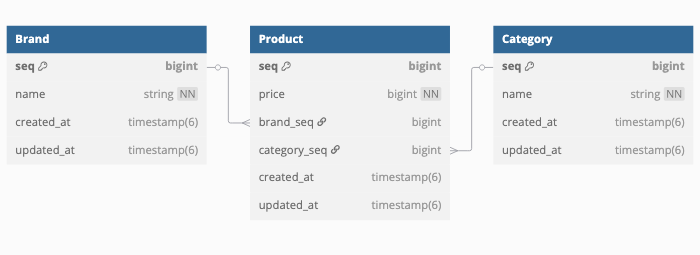

# musinsa-assignment

---

## 실행 방법

- 서버 구동
```
./gradlew app:bootRun
```

- 테스트
```
./gradlew test
```
- 모듈 별 테스트
```
./gradlew ${module_name}:test
```


## 구현 범위 설명

---

[데이터베이스 설계]

- Brand, Product, Category 총 3개의 테이블로 구성하였으며, Product 는 Brand 와 Category 테이블에 연관관계를 갖고 있습니다.
- 비즈니스 정책 상 Brand 와 Category 의 name 은 중복되면 안되는 것으로 가정하고 Unique Index 를 설정하였습니다.
---
[멀티 모듈 아키텍처 적용]
- 의존성이 엄격하게 관리되어 역할에 따라 분리된 모듈들의 결합도를 낮춰 클린하게 유지할 수 있습니다.
- 현재는 bootJar 로 실행 가능한 Application 이 app 모듈밖에 없지만 추후 Batch, Admin 등의 다른 Application 이 필요할 때,
  하위 모듈들을 재사용 할 수 있다는 이점이 있습니다.
- 각 모듈들이 분리되어 있기 때문에 MSA 로의 전환이 보다 쉽다는 장점이 있습니다.
- 구조
    - Application Layer : app
        - 서비스 레이어의 모듈들을 의존하며 외부와 소통을 담당하는 API 가 정의된 Controller 들이 있습니다. 서비스 레이어들의 로직 조합으로 Request, Response 를 처리합니다.
    - Service Layer : product
        - 데이터베이스 레이어 모듈을 의존하며 비즈니스 로직을 담당합니다.
    - Database Layer : core
        - 데이터베이스와 직접 연결되는 모듈로 데이터베이스와의 통신을 담당합니다.
    - Common Layer : common
        - 모든 모듈에서 사용할 수 있는 공통 기능들이 담겨 있습니다

---
[구현 범위 설명]
- 구현 1) - 카테고리 별 최저가격 브랜드와 상품 가격, 총액을 조회하는 API 
  - ``GET api/v1/products/lowest-by-category``
  1. MySQL Query 의 group by 구문을 통해 category 별로 grouping 하여 최저가를 갖는 상품들을 모두 조회
  2. 카테고리별 동일한 최저가를 갖는 상품이 여러개 일 수 있어 비즈니스 로직에서 중복 제거 후 결과 값 반환


- 구현 2) - 단일 브랜드로 모든 카테고리 상품을 구매할 때 최저가격에 판매하는 브랜드와 카테고리의 상품가격, 총액을
  조회하는 API 
  - ``GET api/v1/products/lowest-by-brand``
  1. MySQL Query 의 group by 구문을 통해 brand 및 category 별로 최저가를 갖는 상품들을 모두 조회
  2. 동일한 brand, category, price 를 갖는 상품이 여러개 일 수 있어 비즈니스 로직 상에서 중복 제거
  3. brand 별로 모든 상품의 합을 구해 최저 합계를 갖는 브랜드 선별
  4. 해당 brand 의 정보와 속해있는 상품들을 추출해 응답 값으로 반환
  - [예외] 모든 카테고리 별 상품을 모두 갖고 있어야 최저가 브랜드 후보가 됨  


[구현 1, 2) 공통 예외 처리]
중복 제거 시 비즈니스 정책 상 먼저 등록된 상품이 노출되어야 하는걸로 가정하여 처리


- 구현 3) - 카테고리 이름으로 최저, 최고 가격 브랜드와 상품 가격을 조회하는 API 
  - ``GET api/v1/products/most-by-category``
  1. 카테고리 별 최저가, 최고가 상품을 MySQL Query 의 group by 구문을 통해 조회 및 응답값 반환
  - [예외] 이 경우 여러개가 있더라도 모두 응답 값으로 내려줌


- 구현 4) 브랜드 및 상품을 추가 / 업데이트 / 삭제하는 API
  - ``POST api/v1/admin``
  1. Action, Target 으로 사용 할 기능과 대상을 판별할 수 있도록 요청 값 정의
  2. Controller Layer 의 의존성 최소화와 검증 및 요청, 응답값 처리 집중 역할만 수행하도록 Facade Layer 적용하여 Action 과 Target 에 따른 적절한 Service 분기 호출 처리
  3. 상품 및 브랜드 추가, 업데이트, 삭제 총 6개 기능 가능하도록 구현